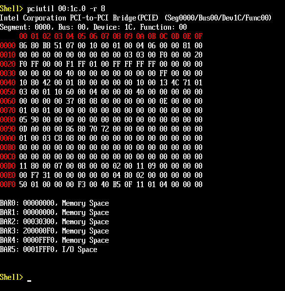
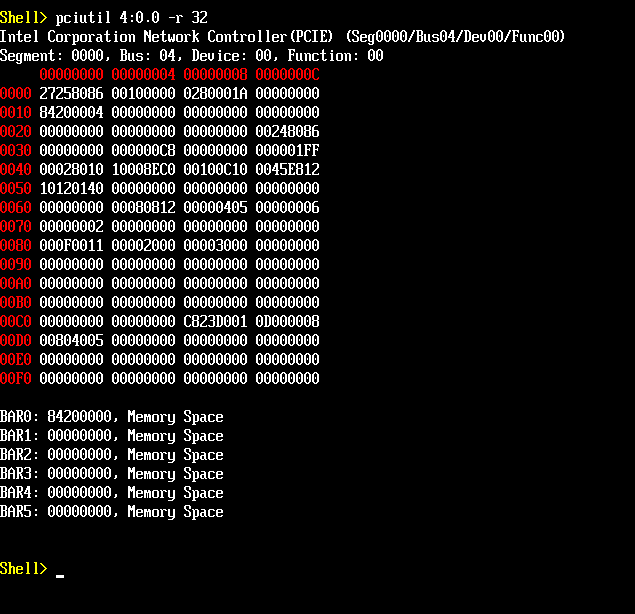
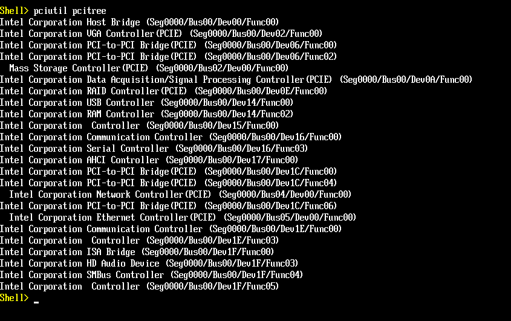

# PciUtil

`PciUtil` is a UEFI Shell application for inspecting PCI/PCIe devices at
boot time: it walks the PCI bus tree, dumps a device's configuration space
(8/16/32-bit, including the PCIe extended configuration space via ECAM), and
prints BAR information. It supports multiple PCI Segment Groups when the
platform publishes an ACPI MCFG table.

## Usage

```
PciUtil <segment:bus:dev.func> -r 8|16|32 [-x]
PciUtil all -r 8|16|32 [-x]
PciUtil pcitree
PciUtil -h
```

| Argument                | Meaning                                                                 |
|--------------------------|--------------------------------------------------------------------------|
| `segment:bus:dev.func`   | Device address, e.g. `00:1f.0` or `0000:00:1f.0`. `segment:` is optional and defaults to `0000`. |
| `all`                    | Dump every discovered device's registers and BARs.                      |
| `pcitree`                | Dump the PCI device tree.                                                |
| `-r 8\|16\|32`           | Register read width. Required for a device address or `all`.            |
| `-x`                     | Also dump `0x100`-`0xFFF` for a PCIe device (only meaningful with `-r 8`). |
| `-h`                     | Show usage.                                                              |

Examples:

```
PciUtil 00:1f.0 -r 8 -x
PciUtil 0000:00:1f.0 -r 8 -x
PciUtil all -r 16
PciUtil pcitree
```

> **Note:** use `-h`, not `-?`, for help. The interactive UEFI Shell
> intercepts any argument starting with `-?` and redirects it to its own
> `help` command before this application ever runs, so `-?` never reaches
> `PciUtil.efi` when typed at the prompt.

## Screenshots

`-r 8` register dump:



`-r 32` register dump:



`pcitree`:



## Building

### 1. Clone edk2

```
git clone https://github.com/tianocore/edk2.git
cd edk2
git submodule update --init --recursive
```

Place this module's sources (`PciUtil.c`, `PciUtil.inf`, `CliParser.*`,
`PciTree.*`, `PciConfigAccess.*`, `RegisterDump.*`, `PciIdNames.*`) under
`MdeModulePkg/Application/PciUtil/` in the tree.

### 2. Add PciUtil to MdeModulePkg.dsc

`PciUtil` is not part of upstream edk2, so it must be added to
`MdeModulePkg/MdeModulePkg.dsc`'s `[Components]` section:

```
[Components]
  MdeModulePkg/Application/PciUtil/PciUtil.inf {
    <LibraryClasses>
      SortLib|MdeModulePkg/Library/UefiSortLib/UefiSortLib.inf
  }
```

The `SortLib` override is required. `MdeModulePkg.dsc`'s package-wide
default (`SortLib|MdeModulePkg/Library/BaseSortLib/BaseSortLib.inf`, near
the top of the file) only implements `PerformQuickSort` - its string-compare
helper `StringNoCaseCompare()` is just an `ASSERT(FALSE)` stub. `PciUtil`
uses `ShellLib`'s `ShellCommandLineParseEx()` for argument parsing, which
calls `StringNoCaseCompare()` to match flag names, so without this override
the app hits that assert on every flag comparison (visible as repeated
`ASSERT ...\BaseSortLib.c(97): ((BOOLEAN) (0==1))` messages) regardless of
whether any arguments were passed. `UefiSortLib` provides a real
implementation and only needs to be selected for this one module - there is
no need to change the package-wide default, which other modules (e.g. PEI
phase components) may rely on staying as `BaseSortLib`.

### 3. Set up the build environment

From the root of the edk2 tree (Windows, Visual Studio 2019 example):

```
edksetup.bat Rebuild
```

This initializes `Conf/target.txt`, `Conf/tools_def.txt`, etc. and builds
BaseTools. You only need to do this once per clone (or after BaseTools
changes).

### 4. Build PciUtil

```
build -p MdeModulePkg/MdeModulePkg.dsc -m .\MdeModulePkg\Application\PciUtil\PciUtil.inf -a X64 -t VS2019 -b RELEASE
```

The resulting `PciUtil.efi` is produced under:

```
Build\MdeModule\RELEASE_VS2019\X64\MdeModulePkg\Application\PciUtil\PciUtil\OUTPUT\PciUtil.efi
```

Copy it to a location reachable from the UEFI Shell (e.g. a USB drive's
FAT partition, or a mapped FV/virtual drive) and run `PciUtil.efi` (or just
`PciUtil` if it's on the current mapped path) from the Shell prompt.
